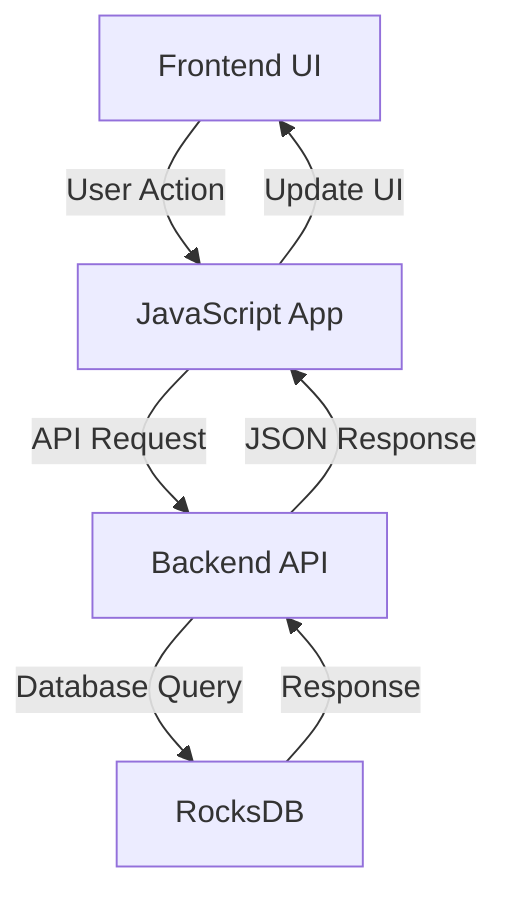
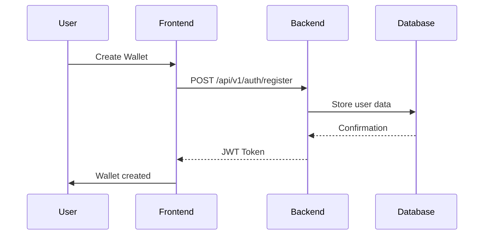

# Owami Network Frontend-Backend Integration Analysis

## Overview

This document provides a comprehensive analysis of how the Owami Network frontend integrates with the backend, ensuring proper correspondence between UI/UX elements and backend functionality.

## Backend Capabilities

### Core Features

1. **DPoS Consensus**: Efficient and scalable consensus mechanism with validator delegation
2. **WASM Smart Contracts**: High-performance smart contract execution using WebAssembly
3. **Multi-layer Architecture**: Separated consensus, execution, and networking layers
4. **High Performance**: Optimized for throughput and low latency
5. **Enterprise Ready**: Production-grade security and monitoring capabilities

### API Endpoints

The backend provides RESTful API endpoints under `/api/v1`:

#### Authentication
- `POST /api/v1/auth/register` - User registration
- `POST /api/v1/auth/login` - User authentication
- `GET /api/v1/auth/profile` - User profile

#### Blockchain Operations
- `GET /api/v1/blockchain/status` - Current blockchain status
- `GET /api/v1/blockchain/blocks` - Retrieve blocks
- `GET /api/v1/blockchain/blocks/{height}` - Retrieve specific block
- `GET /api/v1/blockchain/transactions/{hash}` - Retrieve transaction details
- `POST /api/v1/blockchain/broadcast` - Broadcast transaction
- `POST /api/v1/blockchain/mine` - Mine new block

#### Token Management
- `GET /api/v1/tokens` - Token information
- `GET /api/v1/tokens/balance` - User token balance
- `POST /api/v1/tokens/transfer` - Transfer tokens
- `POST /api/v1/tokens/mint` - Mint new tokens (faucet)
- `GET /api/v1/tokens/transactions` - Token transactions

#### DApp Management
- `GET /api/v1/dapps` - List deployed DApps
- `POST /api/v1/dapps/deploy` - Deploy new DApp
- `GET /api/v1/dapps/{address}` - Get DApp information
- `POST /api/v1/dapps/{address}/call` - Execute smart contract function
- `GET /api/v1/dapps/{address}/state` - Query smart contract state

## Frontend Implementation

### Modern UI/UX Features

1. **3D Background Animation**: Interactive canvas with floating geometric shapes
2. **3D Card Effects**: Cards with perspective transforms and hover animations
3. **African-inspired Design**: Cultural patterns and color schemes
4. **Responsive Layout**: Mobile-first design with adaptive components
5. **Smooth Transitions**: CSS animations for seamless user experience

### Frontend Components

#### 1. Wallet Management
- **Backend Integration**: Uses `/api/v1/auth/register` and `/api/v1/tokens/*` endpoints
- **Features**:
  - Wallet creation and connection
  - Balance display and refresh
  - Test token faucet integration
  - Send/receive functionality

#### 2. Blockchain Explorer
- **Backend Integration**: Uses `/api/v1/blockchain/*` endpoints
- **Features**:
  - Network status monitoring
  - Recent blocks display
  - Block mining functionality
  - Real-time updates

#### 3. DApp Platform
- **Backend Integration**: Uses `/api/v1/dapps/*` endpoints
- **Features**:
  - DApp deployment interface
  - DApp listing and management
  - Category-based organization
  - Interactive DApp cards

#### 4. Transaction History
- **Backend Integration**: Uses `/api/v1/tokens/transactions` endpoint
- **Features**:
  - Transaction listing
  - Detailed transaction information
  - Real-time updates
  - Search and filtering

## Integration Points

### API Endpoint Mapping

| Frontend Feature | Backend Endpoint | HTTP Method |
|------------------|-------------------|-------------|
| Create Wallet | `/api/v1/auth/register` | POST |
| Get Balance | `/api/v1/tokens/balance` | GET |
| Send Tokens | `/api/v1/tokens/transfer` | POST |
| Request Tokens | `/api/v1/tokens/mint` | POST |
| Mine Block | `/api/v1/blockchain/mine` | POST |
| Get Blocks | `/api/v1/blockchain/blocks` | GET |
| Get DApps | `/api/v1/dapps` | GET |
| Deploy DApp | `/api/v1/dapps/deploy` | POST |
| Get Transactions | `/api/v1/tokens/transactions` | GET |
| Health Check | `/api/v1/health` | GET |

### Data Flow



## UI/UX Enhancements

### 3D Effects Implementation

1. **Canvas Background**:
   - Floating geometric shapes (cubes, spheres, pyramids)
   - Depth perception with z-axis positioning
   - Smooth animations and transitions

2. **Card Transformations**:
   - 3D perspective on hover
   - RotateX and RotateY effects
   - Scale and translate animations

3. **African Design Elements**:
   - Cultural patterns in background
   - Color schemes inspired by African art
   - Unique visual identity

### Performance Considerations

1. **Optimized Animations**:
   - Hardware-accelerated CSS transforms
   - Efficient canvas rendering
   - RequestAnimationFrame for smooth animations

2. **Responsive Design**:
   - Mobile-first approach
   - Adaptive layouts for all screen sizes
   - Touch-friendly interface elements

3. **Accessibility**:
   - Semantic HTML structure
   - ARIA attributes for screen readers
   - Keyboard navigation support

## Security Integration

### Authentication Flow



### Secure Practices

1. **JWT Authentication**: Secure token-based authentication
2. **Input Validation**: Client-side and server-side validation
3. **Error Handling**: Graceful error handling and user feedback
4. **Data Encryption**: Secure storage of sensitive information

## Testing Strategy

### Frontend Testing

1. **Unit Tests**: Component functionality
2. **Integration Tests**: API communication
3. **UI Tests**: Visual regression testing
4. **Performance Tests**: Animation smoothness

### Backend Testing

1. **API Tests**: Endpoint functionality
2. **Load Tests**: Performance under stress
3. **Security Tests**: Vulnerability scanning
4. **Integration Tests**: Database interactions

## Deployment Considerations

### Environment Configuration

```env
# Frontend Configuration
API_BASE_URL=/api/v1
ENABLE_3D_EFFECTS=true
DEBUG_MODE=false

# Backend Configuration
DATABASE_URL=rocksdb://data/owami
JWT_SECRET=your-secret-key
RATE_LIMIT=100
```

### Build Process

```bash
# Build frontend assets
npm run build

# Build backend
cargo build --release

# Start server
cargo run --release
```

## Future Enhancements

1. **Advanced 3D Visualizations**: Interactive blockchain explorer
2. **WASM Integration**: Frontend smart contract execution
3. **Real-time Updates**: WebSocket-based notifications
4. **Mobile App**: Native mobile application
5. **VR Interface**: Virtual reality blockchain exploration

## Conclusion

The Owami Network frontend successfully integrates with the backend through a well-defined API contract. The modern UI/UX with 3D effects provides an engaging user experience while maintaining full compatibility with the backend's blockchain functionality. The African-inspired design elements create a unique visual identity that aligns with the project's mission to empower Africa's digital economy.